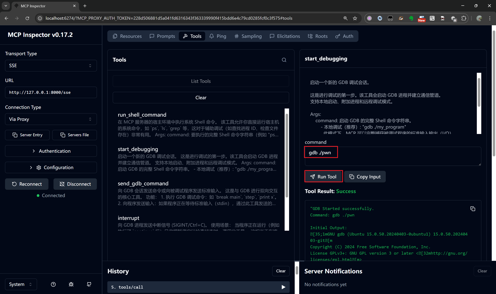
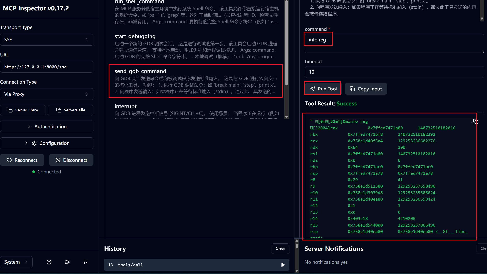

# my_gdb_mcp_server
一个gdb mcp服务端程序，主要封装了启动调试、停止调试、用户输入（命令输入与程序输入）三个基本操作（还有个Ctrl+C信号中断），相当于把人能做的事情赋能给大模型了。另外，封装了一个执行系统命令的操作，相当于万能指令了。

# 软件依赖
```
root@Jtian:/app# python -V
Python 3.12.3
root@Jtian:/app# pip list |grep fastmcp
fastmcp                   1.0
root@Jtian:/app#
root@Jtian:/app# pip list |grep pexpect
pexpect                   4.9.0
root@Jtian:/app#
```

# 测试
## 启动mcp服务端
```bash
root@Jtian:/app#
root@Jtian:/app# python my_gdb_mcp_server.py
INFO:     Started server process [624]
INFO:     Waiting for application startup.
INFO:     Application startup complete.
INFO:     Uvicorn running on http://0.0.0.0:8000 (Press CTRL+C to quit)
```

## 测试mcp服务端
```
npx @modelcontextprotocol/inspector python demo_mcp_server.py --url http://127.0.0.1:8000/sse --transport sse
```






# 其他
## 工具配置参考
```
    "gdb-mcp-server": {
        "type": "sse",
        "url": "http://127.0.0.1:8000/sse",
        "timeout": 1800,
        "disabled": false
    }
```